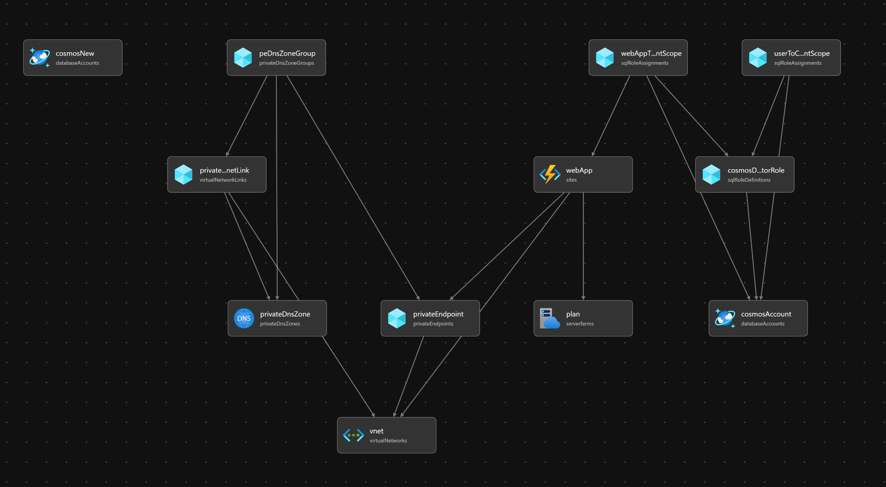

# Azure Bicep  App Service & Cosmos DB Deployment

This repository contains infrastructure-as-code (IaC) templates 📄 and deployment scripts to deploy an Azure App Service ☁️ integrated with Azure Cosmos DB 🪐 using Bicep 💪. `tag: minimal-configuration-for-dev`

## Overview 💪

Cosmos DB is secured behind a private network: public access is disabled and access is allowed only via private endpoints. The App Service is configured with VNet Integration, so incoming requests to the deployed web app access Cosmos DB over the virtual network (via the private endpoint) for secure communication.

### Resources Deployed 📦
- App Service Plan: Premium V3 tier for hosting web apps.
- App Service: Python-based web app with VNet integration.
- Cosmos DB: Supports existing or new accounts with private endpoints.
- Virtual Network: Includes subnets for App Service and Private Endpoint.
- Private DNS Zone: Optional for Cosmos DB private endpoint resolution.
- Azure OpenAI & Speech: Configured for integration with App Service.  


### Files 📂
- `deploy.bicep`: Main Bicep template defining Azure resources.
- `params.json`: Parameter file for customizing deployment.
- `run_infra_deploy.ps1`: PowerShell script to deploy resources using Azure CLI.

## Usage 🛠️
1. Pre-requisites:
   - Install [Azure CLI](https://learn.microsoft.com/cli/azure/install-azure-cli).
   - Log in using `az login`.
   - Ensure Bicep CLI is installed (`az bicep install`).

2. Deployment:
   - Update `params.json` with your configuration.
   - Run the deployment powershell script:
     ```powershell
     ./run_infra_deploy.ps1
     ```

3. Removing Resources:
   - To delete all deployed resources, remove the resource group:
     ```powershell
     az group delete --name <your-resource-group-name> --yes --no-wait
     ```

## Notes 📝
- Ensure proper permissions for Azure resources.
- Replace placeholder values (e.g., `<subscription-id>`, `<tenant-guid>`) in `params.json`.
